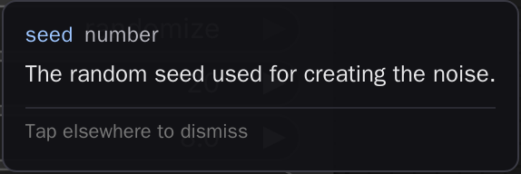

# comfyui-touch-tooltips

Long-press tooltips for ComfyUI widgets, sockets, and node titles on touch devices.

> Part of a family of mobile-first ComfyUI usability packs
> ([gallery-loader](https://github.com/laurigates/comfyui-gallery-loader),
> [sampler-info](https://github.com/laurigates/comfyui-sampler-info),
> [touch-resize](https://github.com/laurigates/comfyui-touch-resize)):
> touch-friendly gestures and HTML popovers that replace clunky native
> LiteGraph interactions, additive and non-clobbering.



*Long-press a widget, socket, or node title on a touch device to read its tooltip.*

## Install

From the Comfy Registry (ships the prebuilt `web/dist/`), or from source:

```sh
cd <ComfyUI>/custom_nodes
git clone https://github.com/laurigates/comfyui-touch-tooltips
cd comfyui-touch-tooltips
bun install
bun run build      # emit web/dist/ (git-ignored; ComfyUI serves it)
```

Restart ComfyUI; hard-refresh the browser tab (Ctrl+Shift+R / Cmd+Shift+R).

## What it does

On a desktop you hover a widget to read its tooltip. On a touch device there is
no hover, so that metadata is invisible. This pack restores it: a **long-press**
(hold ~450ms with less than ~10px of finger movement) on the LiteGraph canvas
hit-tests whatever is under your finger — a node widget, an input/output socket,
or a node title — and surfaces a popover with that element's existing tooltip
metadata (its label, type, and tooltip text). **Tap away or press Escape** to
dismiss it.

The popover reads metadata that is already there (widget options, `INPUT_TYPES`
specs, socket and node-def tooltips); it never fabricates text. When an element
has no tooltip, the popover says so ("(no tooltip)") rather than showing
nothing. It is **touch-only by default** so mouse hover behaves exactly as
before.

## Compatibility

- ComfyUI: modern Vue frontend (`comfyui-frontend-package >= 1.40`) for
  the canvas pointer-event model (`app.canvas`, `convertEventToCanvasOffset`,
  `graph.getNodeOnPos`).
- Frontend changes (JS/CSS) take effect on browser hard-refresh — no restart.

## License

MIT — see `LICENSE`.
